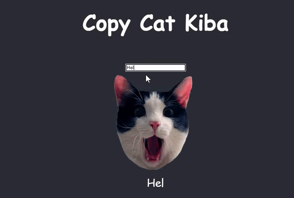

# CopyCat

In this project, a program lets users type into a textbox and allows them to
visualize the immediate effect that these changes have on the web page.

The program displays a textbox with a picture of a cat beneath it. When users
type into the textbox, a copy of the text appears below the cat image, suggesting
that the cat is being a copycat. Clicking on the image of the cat toggles whether
or not it is copying the user.

## Screenshot

## Technology Used

- HTML
- CSS
- JavaScript (ReactJs)

## Source

&copy; [Codecademy.com](https://codecademy.com) 2022.
